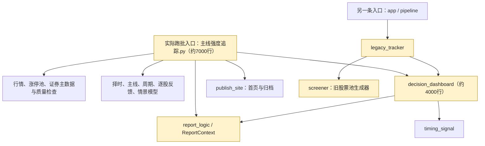

# 报表优化审查：从“复盘很多”到“下一交易日怎么做”

审查日期：2026-09-06
模式：Architecture Audit，聚焦报表的决策可执行性。
范围：当前工作区源码、最新本地主报告/看板/CSV、20份本地审计快照及相关测试；没有联网更新行情，没有回测或修改交易策略。

## 1. 模块依赖图

以下按职责聚合平铺在 src 中的模块，箭头表示调用或依赖，不代表交易信号的优先级。

## 2. 核心结论

**当前系统已具备决策看板的外形，但其主要产出仍是“复盘事实、观察名单和条件描述”，不是经过筛选、定价和验证的交易计划。**

不是再增加一张排行榜，也不是每天必须选出一只可买股票。真正需要补的是：

> 数据是否允许判断 → 当前策略是否适用 → 哪只优先 → 哪个条件成立才进入计划 → 如何分配风险 → 何时取消 → 次日验证结果。

已有的“今日只看三件事”、统一股票池导出、质量检查、历史快照和部分观察模式保护值得保留。此次不建议推倒重写。

### 本地证据概览

- 最新主报告和独立看板的数据截止日均为 **2026-09-03**，不是审查日的最新交易数据。不能直接作为当前下一交易日的买入依据。
- 主报告HTML抽取文本约24,728字符，包含15张表、175个表格行。这里是静态结构统计，不表示这些内容都在首屏可见。
- 最新看板共12条候选：8条观察对象、4条风险锚；统一CSV的12条记录全部标记为“可执行：否”。
- 本地20份审计快照覆盖19个不同报告日期，19份为 observation，1份为 facts_only，**没有 decision 模式**。这是本地样本，不是全部线上历史的统计。
- 最新质量降级涉及 AI 接口503，以及炸板率、回封率、板型结构缺失；不能把“数据不具备决策资格”简单解释为“市场没有机会”。
- 26个已选择的执行计划/观察模式/情景渲染相关测试通过；另有3项独立离线复现实验支持以下发现。

## 3. 主要问题与优化优先级

### P0-1：没有明确区分“不能判断”和“判断后决定不买”

**现象**：多数本地快照处于观察模式。最新页面同时出现“中性震荡”“0成”“数据待核验”，首页还出现“数据完整”的绿色徽标。用户很难知道究竟应当空仓，还是系统缺数据。

**来源**：
- [模式收敛规则](C:/Users/mengk/Desktop/quant_factor_tutorial/src/report_logic.py:387)将质量降级、统计不足等状态收敛到 observation。
- [执行许可](C:/Users/mengk/Desktop/quant_factor_tutorial/src/decision_dashboard.py:585)只在 decision 且非零仓位等条件下成立。
- [首页数据标记](C:/Users/mengk/Desktop/quant_factor_tutorial/src/主线强度追踪.py:6765)把 ok 和 degraded 都视为 data_ok，随后又可能显示“数据待核验”；[徽标渲染](C:/Users/mengk/Desktop/quant_factor_tutorial/src/publish_site.py:156)将 data_ok 直接写成“数据完整”。

**后果**：长期“仅观察”看起来像保守策略，实际可能是数据与发布规则使系统无法产生执行许可；界面也没有解释如何恢复。

**建议**：拆成独立状态并汇总为唯一操作结论：
1. 数据资格：通过 / 缺失 / 过期。
2. 策略资格：适用 / 不适用 / 尚未验证。
3. 信号状态：未触发 / 已满足 / 已失效 / 不可评估。
4. 操作结论：不开新仓 / 等待确认 / 进入可执行计划。

首屏同时显示“为什么不买”与“什么改变才重新评估”。核心行情错误必须阻断；AI文案失败与不同策略所必需的行情缺失应分别处理。**不要为了得到买入名单而直接绕过现有门禁。** 是否允许某个规则策略在部分模块缺失时运行，应按明确依赖、历史验证和回归测试决定。

### P0-2：关键晋级数据存在两套口径，负反馈被摘要漏掉

**现象**：9月3日审计快照的 progression_chain 已记录二进三 **0/7**：昨日7只二板均有结果、无缺失、全部未晋级；ladder_metrics 却记录二进三 0/0，首屏显示“样本待补”。三进四也分别为2/4与2/2。

**来源**：[主入口6100—6108行](C:/Users/mengk/Desktop/quant_factor_tutorial/src/主线强度追踪.py:6100)给逐股反馈链传入补全了昨日成员当日表现的样本，却给梯队指标传入仅当日涨停的样本。[摘要](C:/Users/mengk/Desktop/quant_factor_tutorial/src/decision_dashboard.py:799)使用后者。

**后果**：退出涨停池的失败样本变成“缺失”，样本足够的方向性风险信息被隐藏，也可能使部分晋级率仅反映幸存者。

**复现**：昨日两只二板，今日只有一只三板；仅传今日涨停池得到1/1，补入另一只已断板的当日记录后得到1/2。

**建议**：使用同一个、覆盖昨日全部成员的逐股转移事实源。分别保留已观察、停牌、真实缺失、晋级和失败数量，不用缺失填零，也不把已知失败当缺失。0/7应展示为“0/7，小样本，仅描述当日反馈”，不能将其外推为未来晋级概率为零。

### P0-3：候选排序并不是交易优先级，“唯一主线”可能挂上别的题材

**现象**：首屏写“唯一主线：AI算力”，执行表仍包含机器人、房地产、周期资源等多个方向。用户仍须自行完成最后一次选择。

**来源**：
- [候选角色](C:/Users/mengk/Desktop/quant_factor_tutorial/src/decision_dashboard.py:403)主要按连板高度分配。
- [排序](C:/Users/mengk/Desktop/quant_factor_tutorial/src/decision_dashboard.py:443)按角色、高度、名称；[截取](C:/Users/mengk/Desktop/quant_factor_tutorial/src/decision_dashboard.py:562)最多5条进攻、5条确认、4条风险。
- [主线摘要](C:/Users/mengk/Desktop/quant_factor_tutorial/src/decision_dashboard.py:658)无匹配时使用 same_line or actionable 回退，因此题材标题不一定约束候选。

**复现**：同高度6只候选，其中5只非主线排在名称排序前面，唯一主线股被截掉；界面仍能在“AI算力”标题下显示非主线候选。

**建议**：先做硬条件过滤，再按策略适配、主线匹配、角色、流动性和风险排序，最后截取。分数用于排序，不冒充胜率。无匹配主线股就明确输出“暂无合格候选”，不要借其他题材填满。

默认上限建议为 **1只首选 + 最多2只备选**，这是产品展示上限，不是每日必须选满。每只都要解释“为什么比备选优先”，并说明首选未触发时是否允许替补。

### P1-1：执行条件还是模板，缺少逐票交易参数和持仓状态

**现象**：多个股票共用“首次回封且同题材至少2只红盘”“放量晋级”等文案。“加仓”“减仓”也没有确认用户是否已经持有该股票。

**来源**：[分组模板](C:/Users/mengk/Desktop/quant_factor_tutorial/src/decision_dashboard.py:562)固定生成动作和失效条件，最终候选没有逐票价格、有效期和风险预算。当前本地价格主缓存表头主要是 raw/qfq/legacy 收盘价与来源，不包含完整的开高低成交量字段。

**建议每只候选增加**：
- 策略类型、入选理由、相对备选的优势；接力和趋势低吸不能混用同一买点。
- 可检验的触发条件：指标、时间窗口、比较方式、阈值、数据源、更新时间。
- 入场参考价/区间、最高可接受价、失效参考价、计划到期时间。
- 单票目标仓位与风险预算，组合仓位之和不得超过总上限。
- “空仓用户”与“已持仓用户”两种动作。无持仓输入时不要默认建议加仓/减仓。

补齐所需OHLCV、涨跌停价与盘中快照后，才能可靠计算相应参数；缺字段时写“不可计算”，不能让AI编价格。交易价格用与当日可交易口径一致的未复权价格；收益研究与复权口径分开。

A股T+1必须进入方案：新买股票不能当日卖出；涨停未必买得到，跌停未必卖得出。失效条件不是保证成交的止损承诺。

### P1-2：盘后预案与盘中已确认信号没有清楚分开

本地所查20份审计快照的阶段记录均为 close，未观察到竞价、9:35或10:00验证记录。虽然代码已有阶段与规则基础，但这些样本不能证明盘中触发已被采集、验证。

**建议**：先把日报定位为“盘后生成的下一交易日条件计划”，逐项标注“待人工确认”或“由时间戳为X的快照确认”。若后续接入盘中数据，再将竞价、9:35、10:00更新接入同一个计划对象。没有实时依据时不能显示“已触发”。

### P1-3：复盘统计没有直接回答“这个交易方法赚不赚钱”

最新看板T+3 50%来自6/12条可评分结果。[结果定义](C:/Users/mengk/Desktop/quant_factor_tutorial/src/outcome_definition.py:239)主要按市场宽度、涨跌停、晋级反馈等判定场景命中。它不是这些候选股的可成交交易胜率。

**建议**：保留“市场场景命中率”，新增独立“交易计划复盘”：计划数 → 触发数 → 可成交数 → 实际/模拟成交数 → 扣费后收益、盈亏比、最大不利波动、最大回撤。未触发、买不到、数据缺失要分开记录，不能随意当成功或失败。模拟回测必须考虑T+1、涨跌停、滑点与费用，并区分训练样本和样本外结果。

## 4. 建议的一页报表

### 默认页面：下一交易日行动单

1. **有效期和唯一结论**：数据截止日、计划交易日、是否过期、是否允许新增仓位、理由、总仓位上限。
2. **持仓处理**：已接入持仓才展示；未接入时明确提示“本页只评估新机会”。
3. **首选与备选**：最多3只；禁止新仓时“可执行标的：0只”，观察对象另行收起。
4. **市场风险开关**：最多3项能改变操作结论的条件；标明待确认还是已确认。
5. **昨日计划结果**：有没有触发、能否成交、结果如何。

| 字段 | 应回答的问题 |
|---|---|
| 优先级与标的 | 第一只看谁，谁只是备选？ |
| 策略与理由 | 为什么选它而不是排行榜里另一只？ |
| 触发条件与参考价格 | 什么时候才允许进入计划？ |
| 放弃条件与有效期 | 什么情况不追、不做或取消？ |
| 单票仓位与风险 | 用多少风险预算，和组合上限是否一致？ |
| 持仓后的处理 | 在交易制度允许的时间如何减风险？ |

### 第二层：为什么这样判断

仅展示支持结论的主线强度、晋级反馈、市场宽度与风险数据。所有数字带定义和必要分母；不要用多个无解释的“集中度”并排。

### 第三层：研究资料

N日Top30、热点词云、天梯、历史同型样本、监管谱系、所有诊断字段放入独立研究页或默认收起。它们仍有复盘价值，但不应与可执行标的争夺视觉优先级。

**9月3日材料的历史展示示例（不是当前买入建议）**：
- 新开仓：不允许；可执行标的：0只。
- 市场证据：上涨占比约33.65%、跌停16家、二进三0/7（小样本）。
- 数据问题：炸板/回封/板型数据不完整，AI服务不可用；逐项说明对哪项能力有影响。
- 观察对象和解除观察状态的条件单独列出，不用“明日买入池”命名。
- 页面已过期时明确标注“历史计划，不可沿用”。

## 5. 当前已实施与后续路线\n\n本轮已在当前工作区实施以下内容：\n\n- 新增 `src/decision_readiness.py`，把数据资格、策略资格、信号状态和操作结论分开输出；不改变原有发布门禁。\n- 看板、首页摘要和 `focus_pool.csv` 使用同一份状态；降级数据不再显示绿色“数据完整”。\n- 炸板/回封/板型指标增加字段存在性诊断，区分“字段未提供”和“实际观测到0”。\n- 晋级率支持完整的当日转移结果，9月3日样例的二进三可以统一显示为 `0/7`，不把断板成员漏出分母。\n- 主线候选不再回退到其他题材；执行模式最多输出1个首选和2个备选，观察模式不输出交易优先级。\n- AI网络诊断已确认：行情接口正常；AI中转可达但主模型返回503模型路由不可用，备用模型返回403权限不足；没有修改密钥或擅自更换模型。\n- 验证结果：全量 `717 passed，3 warnings`；警告为既有 pandas FutureWarning。\n\n## 6. 实施路线：推荐中间方案

| 方案 | 能解决什么 | 局限 | 建议 |
|---|---|---|---|
| 只折叠图表、改颜色 | 减少阅读负担 | 选股、数据口径与执行资格仍不清楚 | 可做，但不能单独作为完成标准 |
| 统一TradingPlan + 候选优先级 + 一页行动单 | 真正把事实转化为唯一、可追溯计划 | 需要补充契约与一致性测试 | **优先实施** |
| 实时盯盘与持仓管理 | 自动确认盘中条件与持仓动作 | 需要行情、状态更新、交易规则和更完整验证 | 第二阶段再考虑 |

推荐按以下顺序落地：
1. 先修晋级分母、状态矛盾与过期计划提示。
2. 把候选优先级与执行资格从渲染器提取为纯逻辑，输出统一TradingPlan。
3. 主报告、独立看板、首页、CSV都读取同一个计划；已有同源CSV逻辑保留，不重新开发一条选股旁路。
4. 一页行动单取代默认长报告；研究内容另页保留。
5. 补齐价格/成交量/盘中验证及持仓输入，再增强具体执行参数。
6. 加入以可成交计划为单位的样本外复盘，决定是否调整策略门槛和排序。

建议契约包含：as_of、plan_trade_date、valid_until、data_status、strategy_status、default_action、no_trade_reasons、position_cap、primary、alternates、watchlist、risk_rules、rule_version、evidence_ids。

## 7. 必须补的验收用例

- 可执行标的最多3只；不合格时允许0只，不强行填满。
- 主线标的不存在时，不能在该主线标题下回退显示其他题材。
- 与主线匹配的合格候选不能仅因名称排序在截断时被漏掉。
- 昨日7只二板且当日结果完整、0只晋级：各展示面都显示0/7，并标注小样本，而不是0/0或未知。
- 晋级失败、停牌、真实缺失分别计数；只统计留在涨停池的幸存者不能作为整体晋级率。
- 禁止新仓时，所有页面和CSV中的可执行标的数量都为0；观察清单可以存在，但身份不能混淆。
- 未取得对应时点数据时，不得把竞价/9:35/10:00条件标记为已确认。
- 未输入持仓时，不默认输出实际加减仓指令。
- 逐票风险预算与仓位满足组合上限；参考价缺失或过期不生成虚构数字。
- 当前日期超过计划有效期时，明确展示过期，历史CSV不能冒充新计划。
- 市场场景命中率与交易收益统计分开，未触发和不可成交不混进已成交胜率。

## 8. 工程侧补充与审查边界

- 当前真实跑批入口、旧legacy入口和README所述四阶段框架并不完全等价。应在上述改造时明确唯一生产入口，避免旧screener路径重新产生不同口径的名单；不建议为此先做全项目重构。
- 决策看板约4000行且同时负责推导动作、分配仓位、处理质量和HTML渲染。已有纯函数是良好切入点，把TradingPlan构建与展示分离，便于单测和逐个页面验收。
- 未发现足以评价团队协作边界的材料；不作Conway组织结构判断，也不输出无依据的架构健康分数。
- 保留了工作区已有的未提交代码、测试和数据修改。本轮修改了 P0-1/P0-2/P0-3 的报表与事实口径代码及测试，但没有修改选股阈值、仓位算法、行情缓存或下单行为。
- 浏览器安全策略不允许本地file页面预览，因此本轮使用HTML静态提取、源码追踪和离线复现，不声称完成浏览器视觉验收。
- 相关测试结果：全量 717 passed，3 warnings；另完成网络诊断和离线渲染复核。不是真实交易回测或投资收益保证。

**一句话建议：让研究页负责“解释市场”，让首页只负责“给出有条件、有优先级、有风险边界、可复盘的下一交易日计划”。**

## 9. 本轮实现状态

按优先级完成了 P0-1、P0-2、P0-3、P1-1、P1-2、P1-3：

- P0-1：新增四层决策资格状态，首页/看板/CSV同源，区分数据缺失、策略未验证和决定不买。
- P0-2：晋级率使用完整当日转移结果，避免把断板成员从分母中漏掉。
- P0-3：主线候选不跨题材回填，支持条件计划的首选和最多两个备选。
- P1-1：逐票执行契约加入收盘参考、价格参数可用性、持仓状态、T+1和有效期；没有OHLCV/持仓时不虚构。
- P1-2：新增盘后条件计划与盘中阶段观测状态；收盘场景不被标为下一交易日已触发。
- P1-3：新增 `trade_plan_review.py` 追加式交易计划事件和独立复盘面板，成交收益只来自明确的filled记录。

网络诊断（2026-09-06）：东财、同花顺、AkShare、腾讯行情接口正常返回；AI中转网络可达，但主模型503模型路由不可用，备用模型403权限不足。本轮未更换模型或密钥。

最终验证：`python -m pytest tests -q -p no:cacheprovider` 为 730 passed，3个既有 pandas FutureWarning；`python -m compileall -q src tests` 与 `git diff --check` 通过。
